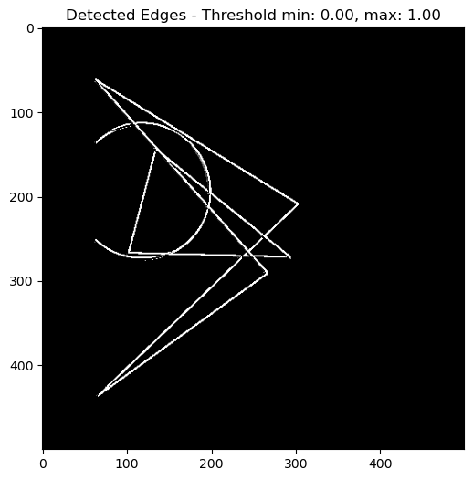
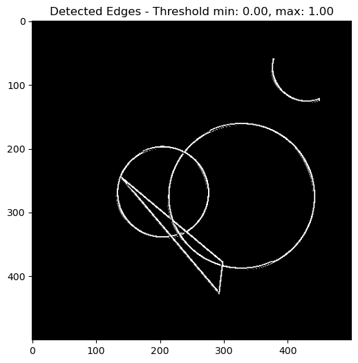
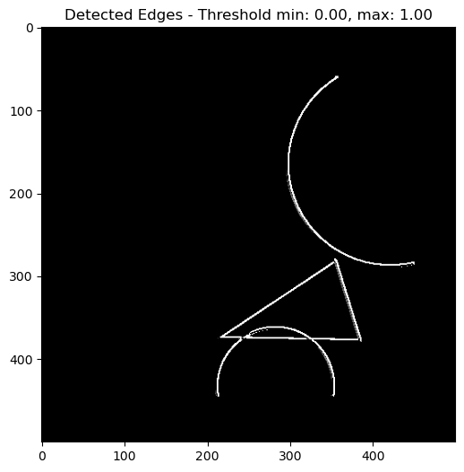
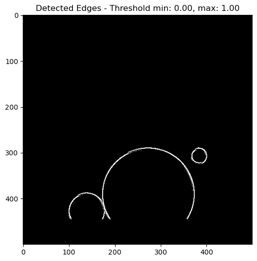
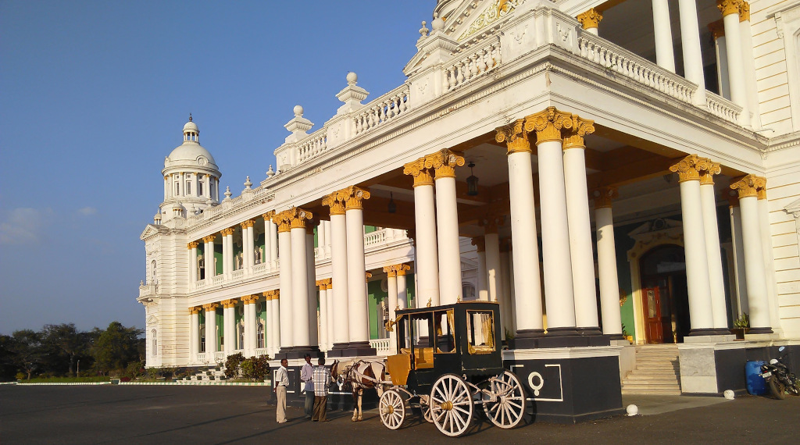
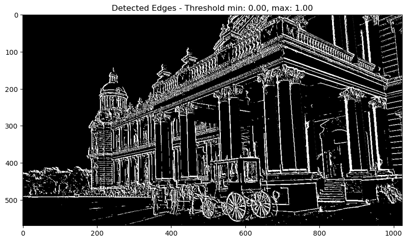

# Edge Detection

> Alli Khadga Jyoth - M23CSA003
> 
> [Colab Link](https://colab.research.google.com/drive/1Ci8VfIb22C6VWydiawjvsKagpthuyvTm?usp=drive_link)
> 
> [Synthetic Images](https://drive.google.com/drive/folders/15kb24JeZd1HPh9Shrk86krKctAh_o3tD?usp=drive_link)
> 
## Overall Approach

The aim of this assignment was to do Edge-Detection using the approaches taught in module 02-02. To achieve this we are using, Sobel Filters to find the gradients along different directions. Then we do Winner-Takes-All Normalization to get maximum edges at each pixel. We will elobarate these steps in the following sections.

## Image Preprocessing

After we load the RGB image, we need to process the image and convert the image to grayscale. For this we use OpenCV Library.

## Filtering

We are then doing Difference of Gaussians (DoG) filtering, which is an apprioximation of Lagrangian of Gaussian (LoG) filtering. By doing this we are enhancing the edges present in the image.

## Winner-Takes-All Normalization

It is a type of pooling technique, where the value of edge at each pixel location is given as some `constant * normalized max value (wrto. all directions)`.

## Experimentation

Since there might be some spurious edges present, we use thresholding to supress those edges. However, we donot know which threshold is better for our image, so we experiment with various thresholding values, and select the one with the best representation of edges.

## Results for Synthetic Images

### Synthetic Image 1

    
    

### Synthetic Image 2

    
    

### Synthetic Image 3

    
    

### Synthetic Image 4

    
    

### Given Image

    
    

## References

1. [https://matplotlib.org/stable/api/patches_api.html](https://matplotlib.org/stable/api/patches_api.html) - Creating Synthetic Images
2. [https://www.geeksforgeeks.org/how-to-draw-shapes-in-matplotlib-with-python/?ref=asr4](https://www.geeksforgeeks.org/how-to-draw-shapes-in-matplotlib-with-python/?ref=asr4) - Creating Synthetic Images
3. [https://dsp.stackexchange.com/questions/12821/detecting-edges-oriented-at-certain-angle](https://dsp.stackexchange.com/questions/12821/detecting-edges-oriented-at-certain-angle) - Gradients along different directions using differentiating filters (Sobel filter)
4. [https://github.com/KhadgaA/Camera-Calibration-and-Stereo/blob/main/M23CSA003_qu1.py](https://github.com/KhadgaA/Camera-Calibration-and-Stereo/blob/main/M23CSA003_qu1.py) - Gaussian Filtering, Sobel Filtering.
5. Carandini, M., Heeger, D. Normalization as a canonical neural computation. Nat Rev Neurosci 13, 51–62 (2012). [https://doi.org/10.1038/nrn3136](https://doi.org/10.1038/nrn3136) - Normalization technique: Winner-Takes-All
