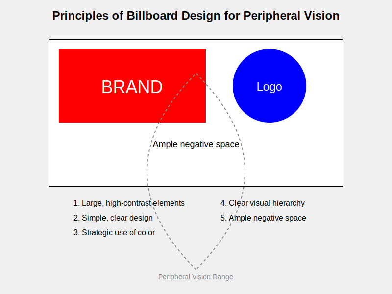

# The Impact of Peripheral Vision on Billboard and Advertisement Design

> Alli Khadga Jyoth - M23CSA003  
>
## Introduction

Peripheral vision is very important for how we see and interact with our surroundings, especially when we need to process information quickly and effectively, like when we're looking at signs or advertising hoardings. These ads can be improved by understanding how peripheral vision affects user engagement and interface design. This subject is important because it connects cognitive psychology with real-world design. It can help us come up with better design techniques that get people's attention, make the whole user experience better, and make sure visual communication is safer.

## Importance of Peripheral Vision in Billboard Design

Peripheral vision is what detects motion and gives you a general idea of what's going on around you. This is very important for paying attention in fast-paced places like roads or busy streets. It provides context to our central vision and can capture the viewer's attention even when they are not directly looking at the advertisement. This is especially important for digital billboards, whose material often changes quickly and is dynamic. It is important for billboards and other advertising hoardings to be made in a way that uses peripheral vision to grab and hold people's attention without creating safety issues through distractions.

## Key Findings from Research

### Eye-Controlled Systems and Peripheral Vision

A study on eye-controlled systems shows how important it is for user interfaces to have engaging parts that are the right shape, size, and distance away from each other. The study discovered that these things have a big effect on how quickly people respond and move when they use their eyes to control other people. The study suggests using clear, simple forms and exact sizes and distances to make user recognition work better.

### Digital Billboards and Driver Behavior

Research on digital billboards along roads shows that quickly changing stimuli in the periphery of vision can catch people's attention without them realizing it, which can cause them to look longer and off-road more often. This shift in focus can be dangerous, especially when signs change from one ad to another. The study discovered that dynamic billboards change the number and amount of glances toward them in a big way. This change is especially noticeable when switching between ads. This makes people look away from the road more often, which could make them less safe [1].

### Information Visualization and Peripheral Vision

How much of a display appears in peripheral vision affects eye movements, according to another study. According to the study, knowing what information you can get from your peripheral vision can help you make  better user experiences and visualizations. Designers can better guide eye movements and make more interesting visual content [3] by making important information easy to see at a glance.

## Design Recommendations

Based on the study results, the following design suggestions can be made for billboards and other large advertising signs:

1. **Use of Simple and Concrete Shapes:** Billboard designs should use simple forms that are easy to recognize so that they can be recognized quickly with peripheral vision. This might help you get people's attention better [2].
2. **Optimal Size and Distance:**  The billboard's elements should be made as big and far apart as possible so that they are within the useful range of peripheral vision. Adding this can help the ad [2] stand out and be easier to read.
3. **Dynamic Elements and Safety:**  Dynamic features can be interesting, but they should be used carefully so they don't become a distraction, especially in places with a lot of speed, like highways. To keep safety risks to a minimum, the changes between ads should be easy and not happen too often. [1].
4. **Guiding Eye Movements:** When making billboards, designers should think about how peripheral vision affects eye movements and arrange the words in a way that draws attention to the most important information. One way to do this is to carefully place important things in the range of peripheral vision [3].
5. **Utilizing Color and Contrast:** Use of strong contrast and bright colors can make signs much easier to see from the side. But you should be careful how you use these parts so they don't become too much. It's important for designers to make a clear visual order, where the most important information stands out.
6. **Simplifying Messages:** Because peripheral vision can only handle so much information at once, billboard messages should be short and clear. It's less possible that peripheral vision will help you get across complicated messages or a lot of information. A strong visual feature along with a simple, powerful message may work better.

## Critical Comments

Even though the study tells us a lot about how peripheral vision works in user interface and poster design, it is important to think about how these results can be used. For example, the suggestions for eye-controlled systems might not directly apply to designing a billboard, but the basic ideas of optimizing form, size, and distance are still useful.

Concerns about safety raised by the study on digital billboards should also not be ignored. They show how important it is to find a mix that gets people's attention without putting their safety at risk. When making designs that get people's attention, designers have to carefully weigh the pros and cons of safety risks, especially in high-risk places like roads.

## Conclusion

When designing signs and other advertising hoardings, taking peripheral vision into account can make them much more effective. Designers can make ads that get people's attention and get their message across quickly by using simple shapes, maximizing size and distance, carefully handling dynamic elements, and making good use of color and contrast. However, it is important to make sure that these design choices don't get in the way of safety and that the ads don't become a distraction, especially in dangerous places like roads. The objective should be to make signs that improve the visual environment while keeping people safe. To make these strategies better and make sure that billboards and ads use peripheral vision well without compromising safety or looks, more study needs to be done in this area.

## References

1. Belyusar, Daniel, Bryan Reimer, Bruce Mehler, and Joseph F. Coughlin. 2016. “A Field Study on the Effects ofDigital Billboards on Glance Behavior During Highway Driving.”Accident Analysis & Prevention88: 88–96.<https://doi.org/https://doi.org/10.1016/j.aap.2015.12.014>.
2. Niu, Yafeng, Jingze Tian, Zijian Han, Mengyuan Qu, Mu Tong, Wenjun Yang, and Chengqi Xue. 2022. “EnhancingUser Experience of Eye-Controlled Systems: Design Recommendations on the Optimal Size, Distance and Shapeof Interactive Components from the Perspective of Peripheral Vision.”International Journal of EnvironmentalResearch and Public Health19 (17). <https://doi.org/10.3390/ijerph191710737>.
3. Raj, Alvin, and Ruth Rosenholtz. 2010. “What Your Design Looks Like to Peripheral Vision.” InProceedings of the7th Symposium on Applied Perception in Graphics and Visualization, 89–92. APGV ’10. New York, NY, USA:Association for Computing Machinery. <https://doi.org/10.1145/1836248.1836264.2>
